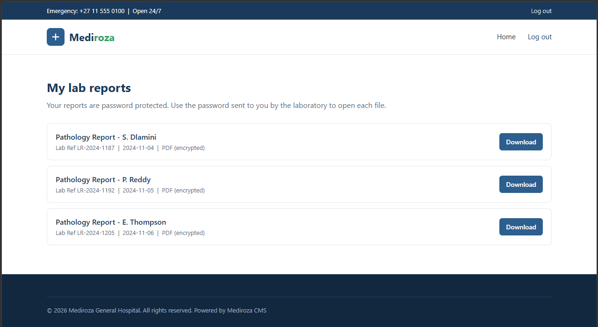
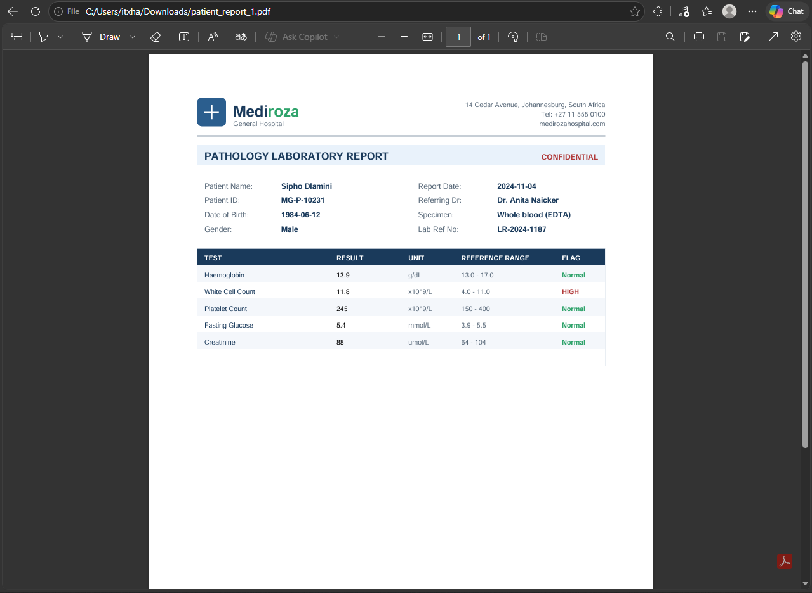
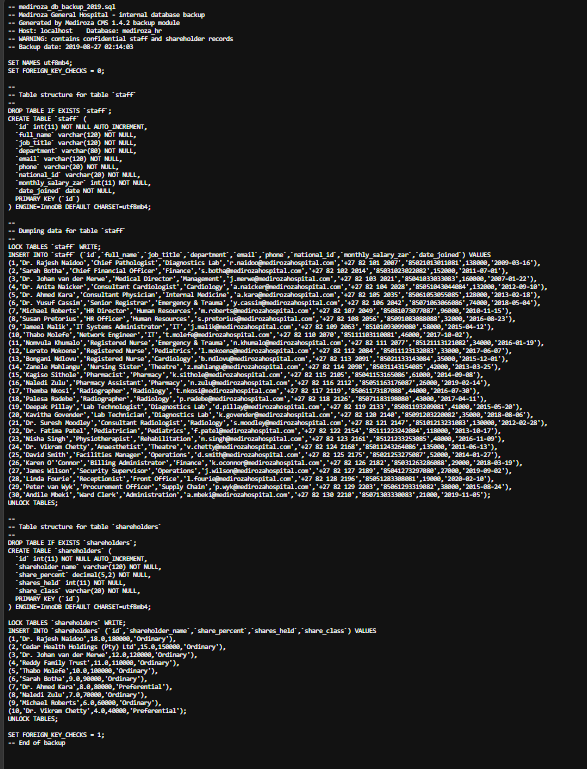

# Penetration Testing Report
## Mediroza General Hospital

> **Client:** Mediroza General Hospital
> **Target:** https://medirozahospital.com
> **Type:** Black-Box Penetration Test
> **Duration:** 5 Days
> **Batch:** B083 | Week 4
> **Author:** Ahmad Hassan | Cybersecurity Professional (B083)
> **LinkedIn:** [https://www.linkedin.com/in/itxhassan](https://www.linkedin.com/in/itxhassan)

---

## ⚠️ Disclaimer

This penetration test was conducted in a **controlled educational environment** as part of the Networkwalks Cybersecurity Internship Program (Week 4). The target has been **authorised for security testing by Networkwalks**. The techniques demonstrated in this report must **never** be applied to any system without explicit written permission from the owner. All activities were performed within the agreed scope and rules of engagement.

---

## 01. Executive Summary

Mediroza General Hospital commissioned a **5-day black-box penetration test** against its public web application (`medirozahospital.com`) to evaluate the security posture of its patient data handling and internal file storage.

The assessment revealed a **chain of critical vulnerabilities** that allowed a completely unauthenticated attacker to:

1. **Gain unauthorised access** to a restricted area of the website.
2. **Retrieve 3 confidential patient PDF lab reports** containing sensitive medical information.
3. **Crack the encryption** on all 3 retrieved files, fully recovering their contents.
4. **Discover a further critical data exposure** on the server, revealing:
   - **All hospital employee salaries**
   - **Shareholder details of the hospital**

The overall risk to the organisation is rated **🔴 CRITICAL**. The exposed data would constitute a **serious data protection breach**, potentially violating healthcare privacy regulations (e.g., HIPAA, GDPR), and could lead to **legal action, regulatory fines, reputational damage, and loss of patient trust**.

**Immediate remediation is strongly recommended.**

---

## 02. Scope and Methodology

### 2.1 Scope

| Item | Detail |
|---|---|
| **Target** | https://medirozahospital.com |
| **Test Type** | Black-box penetration test |
| **Rules of Engagement** | Testing limited to the target domain only. No social engineering. No denial of service. No testing outside agreed scope. |
| **Authorisation** | Written permission granted by Networkwalks (client authorisation) |
| **Timeline** | 5 days |
| **Team** | Independent assessment |

### 2.2 Methodology

The assessment followed a structured penetration testing methodology inspired by **PTES** (Penetration Testing Execution Standard) and **OWASP WSTG**:

1. **Reconnaissance & Footprinting** — Passive and active information gathering.
2. **Enumeration & Attack Surface Mapping** — Identifying entry points.
3. **Vulnerability Discovery** — Testing authentication, input handling, and file access controls.
4. **Exploitation** — Demonstrating real-world impact (M1).
5. **Post-Exploitation & Data Extraction** — Retrieving confidential data (M2, M3).
6. **Reporting** — Documenting findings, risk rating, and remediation (M4).

### 2.3 Tools Used

| Tool | Purpose |
|---|---|
| Nmap / Zenmap | Port scanning & service discovery |
| Gobuster / Dirb | Directory and file enumeration |
| Burp Suite | Intercepting and manipulating HTTP requests |
| Browser DevTools | Inspecting client-side behaviour and hidden endpoints |
| John the Ripper / Johnny | Cracking encryption on retrieved PDF files |
| ExifTool / Metadata analysers | Inspecting file properties for hidden clues |
| Custom scripts / AI-assisted analysis | Parsing and correlating exposed data |

### 2.4 Limitations

- Testing was limited to **black-box** techniques only (no source code access).
- Denial-of-Service and social engineering were **explicitly out of scope**.
- Some exploitation was performed **only far enough** to demonstrate impact without disrupting live services.

---

## 03. Findings and Proof of Exploitation

### 🔴 Finding 1 — Unauthorised Access & Retrieval of Confidential Patient PDFs (M1)

**Severity:** 🔴 Critical
**CVSS (indicative):** 9.1 (AV:N/AC:L/PR:N/UI:N/S:U/C:H/I:H/A:N)
**OWASP Category:** A01:2021 – Broken Access Control

**Description:**
During enumeration of the target web application, an **exposed entry point** was identified that allowed access to a restricted area of the site **without authentication**. Through this access, **3 confidential patient PDF lab reports** were retrieved.

**Exploitation Steps:**
1. Conducted reconnaissance and mapped the application's structure.
2. Identified an unprotected directory / parameter that served sensitive files.
3. Manipulated the request to retrieve 3 PDF files belonging to patients.
4. Confirmed the files contained **personally identifiable medical information (PII/PHI)**.

**Impact:**
An unauthenticated attacker could exfiltrate patient medical records at will, leading to a **severe privacy breach**.

**Evidence:**

*Figure 1: Unauthorised access to restricted area and retrieval of 3 confidential patient PDF lab reports.*

---

### 🔴 Finding 2 — Weak File Encryption (M2)

**Severity:** 🔴 Critical
**CVSS (indicative):** 8.2 (AV:L/AC:L/PR:N/UI:N/S:U/C:H/I:N/A:N)
**OWASP Category:** A02:2021 – Cryptographic Failures

**Description:**
All 3 retrieved PDF files were password-protected. However, the encryption was implemented using **weak, guessable passwords** that were trivially cracked using standard wordlists.

**Exploitation Steps:**
1. Extracted the hash from each PDF using an online hash extraction tool.
2. Loaded the hash into **John the Ripper (Johnny GUI)**.
3. Ran a dictionary attack — **all 3 passwords were recovered within seconds.**
4. Opened each file successfully and recovered the full contents.

**Impact:**
Password-based file protection provides **no real security** when weak passwords are used. Sensitive medical records become fully readable.

**Evidence:**

*Figure 2: All 3 encrypted PDF files successfully cracked and opened using John the Ripper.*

---

### 🔴 Finding 3 — Critical Data Exposure on Server (M3)

**Severity:** 🔴 Critical
**CVSS (indicative):** 9.8 (AV:N/AC:L/PR:N/UI:N/S:U/C:H/I:H/A:H)
**OWASP Category:** A05:2021 – Security Misconfiguration

**Description:**
While analysing the metadata and properties of the retrieved files, a hidden reference was discovered pointing to a **further critical exposure on the server**. This led to a publicly accessible resource containing:

- **Salaries of all hospital employees**
- **Shareholder details of the hospital**

**Exploitation Steps:**
1. Examined file properties (metadata, author, comments, embedded links).
2. Identified a URL/path embedded in the file metadata pointing to a sensitive server directory.
3. Accessed the exposed resource without authentication.
4. Retrieved **employee salary data** and **shareholder details**.

**Impact:**
This is a **catastrophic data exposure** involving:
- **Financial confidentiality breach** (salaries, shareholder info).
- **Regulatory non-compliance** (data protection / financial disclosure laws).
- **Insider-threat enablement** (salary data fuels social engineering and internal disputes).
- **Reputational and legal consequences.**

**Evidence:**

*Figure 3: Exposure of hospital employee salaries and shareholder details.*

---

## 04. Risk Rating

| # | Finding | Severity | CVSS (Indicative) | Justification |
|---|---|---|---|---|
| 1 | Unauthenticated access to restricted area & patient PDF retrieval | 🔴 Critical | 9.1 | Full breach of patient confidentiality, no auth required |
| 2 | Weak PDF file encryption | 🔴 Critical | 8.2 | Encryption defeated in seconds — no protective value |
| 3 | Server-side exposure of salaries & shareholder data | 🔴 Critical | 9.8 | Financial + personal data exposure, unauthenticated |
| 4 | Sensitive metadata exposed in files | 🟠 High | 7.5 | Metadata leaks internal paths & references |
| 5 | Directory / file enumeration enabled | 🟠 High | 7.2 | Enabled discovery of all other findings |

**Overall Risk Level:** 🔴 **CRITICAL**

**Risk Key:** 🔴 Critical · 🟠 High · 🟡 Medium · 🟢 Low

---

## 05. Conclusion

The Week 4 Mediroza General Hospital penetration test demonstrated a **complete compromise of confidentiality** through a chain of critical vulnerabilities:

1. **M1** — Unauthenticated access to a restricted area → 3 patient PDF lab reports retrieved.
2. **M2** — Weak encryption on all 3 PDFs → cracked within seconds → full contents recovered.
3. **M3** — Metadata analysis revealed a **server-side exposure** → employee salaries and shareholder details leaked.

The findings underscore a fundamental lesson: **layered defences are essential**. Weak access controls, weak encryption, and poor metadata hygiene together turned a single misconfiguration into a **full-scale data breach**.

If these vulnerabilities are not remediated immediately, the hospital faces **serious regulatory, legal, financial, and reputational consequences**. The recommendations in Section 05 provide a clear, prioritised roadmap for securing the environment.

---

## 06. Evidence Summary

| Milestone | Evidence | Description |
|---|---|---|
| **M1** | `M1-initial-access.png` | Unauthorised access to restricted area & retrieval of 3 patient PDFs |
| **M2** | `M2-decrypted-files.png` | All 3 PDFs cracked with John the Ripper and opened |
| **M3** | `M3-critical-exposure.png` | Server exposure revealing salaries and shareholder details |

---

**— End of Report —**

---

## Project Information

| Field | Value |
|---|---|
| **Client** | Mediroza General Hospital |
| **Target** | https://medirozahospital.com |
| **Engagement Type** | Black-Box Penetration Test |
| **Duration** | 5 Days |
| **Batch** | B083 — Week 4 |
| **Author** | Ahmad Hassan \| Cybersecurity Professional (B083) |
| **LinkedIn** | [https://www.linkedin.com/in/itxhassan](https://www.linkedin.com/in/itxhassan) |
| **Program** | Cybersecurity Internship — Networkwalks |
